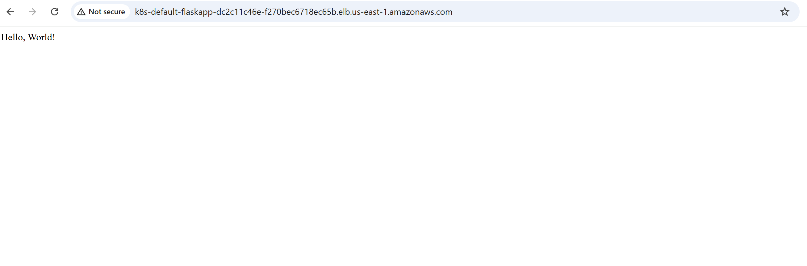
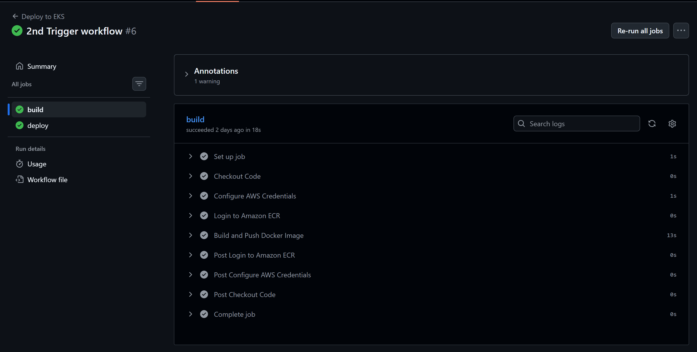
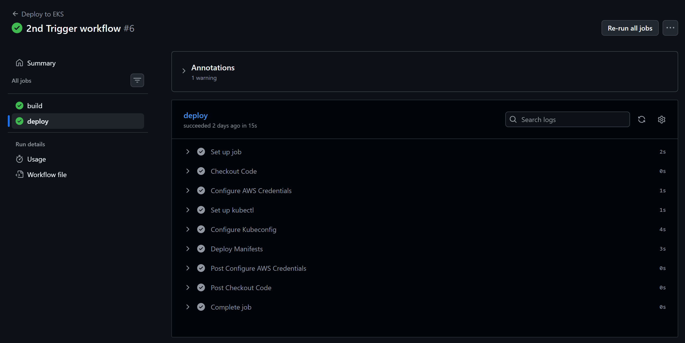
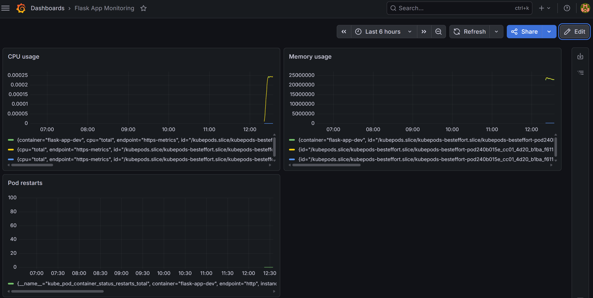
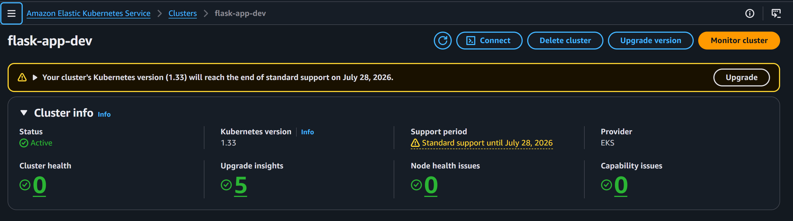

# EKS DevOps Pipeline
An end-to-end DevOps pipeline that containerizes a Flask application and deploys it to AWS EKS using Terraform for infrastructure provisioning, Kubernetes for orchestration, GitHub Actions for CI/CD automation, and Prometheus with Grafana for observability.

## Architecture

```
Developer Push
      │
      ▼
GitHub Actions CI/CD
      │
      ├── Build Docker Image
      ├── Push to Amazon ECR
      └── Deploy to EKS
              │
              ▼
    AWS EKS Cluster (us-east-1)
              │
         ┌────┴────┐
         │   VPC   │
         │         │
    Public Subnet  Private Subnet
    (Load Balancer) (Worker Nodes)
                        │
                   Flask App Pod
                        │
              Prometheus + Grafana
                  (Monitoring)
```

## Tech Stack

**Flask** -> Python web application 
**Docker** -> Containerization 
**Amazon ECR** -> Container image registry 
**Terraform** -> Infrastructure as Code (VPC, EKS) 
**Amazon EKS** -> Managed Kubernetes cluster 
**Kubernetes** -> Container orchestration 
**GitHub Actions** -> CI/CD pipeline 
**Prometheus** -> Metrics collection 
**Grafana** -> Metrics visualization 
**AWS IAM OIDC** -> Keyless authentication for GitHub Actions 
**Helm** -> Kubernetes package manager 

## Project Structure

```
eks-devops-pipeline/
├── .github/
│   └── workflows/
│       └── deploy.yml          # GitHub Actions CI/CD pipeline
├── k8/
│   ├── deployment.yaml         # Kubernetes Deployment manifest
│   └── service.yaml            # Kubernetes LoadBalancer Service
├── terraform/
│   ├── providers.tf            # AWS provider configuration
│   ├── variables.tf            # Input variables
│   ├── main.tf                 # VPC and EKS modules
│   ├── outputs.tf              # Cluster endpoint and name outputs
│   └── github-oidc.tf          # IAM OIDC for GitHub Actions
├── screenshots/                # Project screenshots
├── app.py                      # Flask application
├── Dockerfile                  # Container definition
└── requirements.txt            # Python dependencies
```

## Prerequisites

Before you begin make sure you have the following installed and configured:

- **AWS CLI** — configured with appropriate permissions (`aws configure`)
- **Terraform** v1.0+
- **Docker Desktop**
- **kubectl**
- **Helm**
- **Git**

## Deployment

### **Step 1 — Clone the repository**

```bash
git clone https://github.com/TheLazyLearnerIII/eks-devops-pipeline.git
cd eks-devops-pipeline
```

### **Step 2 — Provision infrastructure with Terraform**

```bash
cd terraform
terraform init
terraform plan
terraform apply
```

**This provisions:**
- VPC with public and private subnets across 3 availability zones
- NAT Gateway for private subnet internet access
- EKS cluster with Auto Mode enabled
- IAM OIDC provider for GitHub Actions keyless authentication


### **Step 3 — Configure kubectl**

```bash
aws eks update-kubeconfig --region us-east-1 --name flask-app-dev
```

### **Step 4 — Grant cluster access**

Replace `<ACCOUNT_ID>` and `<USERNAME>` with your AWS account ID and IAM username.

```bash
aws eks create-access-entry \
  --cluster-name flask-app-dev \
  --principal-arn arn:aws:iam::<ACCOUNT_ID>:user/<USERNAME> \
  --type STANDARD

aws eks associate-access-policy \
  --cluster-name flask-app-dev \
  --principal-arn arn:aws:iam::<ACCOUNT_ID>:user/<USERNAME> \
  --policy-arn arn:aws:eks::aws:cluster-access-policy/AmazonEKSClusterAdminPolicy \
  --access-scope type=cluster
```

### **Step 5 — Deploy the application**

```bash
kubectl apply -f k8/deployment.yaml
kubectl apply -f k8/service.yaml
```

**Verify the pod is running:**

```bash
kubectl get pods
```

**Get the application URL:**

```bash
kubectl get service flask-app
```

Open the `EXTERNAL-IP` in your browser. It may take 3-5 minutes for the load balancer to provision.

### **Step 6 — Deploy monitoring stack**

```bash
helm repo add prometheus-community https://prometheus-community.github.io/helm-charts
helm repo update

helm install monitoring prometheus-community/kube-prometheus-stack \
  --namespace monitoring \
  --create-namespace \
  --set grafana.adminPassword=<YOUR_PASSWORD>
```

**Get the Grafana pod name:**

```bash
kubectl --namespace monitoring get pods -l "app.kubernetes.io/name=grafana"
```

**Access Grafana:**

```bash
kubectl --namespace monitoring port-forward <grafana-pod-name> 3000
```

Open `http://localhost:3000` and log in with username `admin` and the password you set above.

### **Step 7 — CI/CD**

Push any change to `main` and GitHub Actions will automatically:

1. ✅ Authenticate to AWS via OIDC (no stored credentials)
2. ✅ Build a new Docker image
3. ✅ Push it to Amazon ECR
4. ✅ Deploy it to EKS

## Screenshots

### Flask App Live on AWS


### GitHub Actions Pipeline — Build Job


### GitHub Actions Pipeline — Deploy Job


### Grafana Monitoring Dashboard


### EKS Cluster Active


---

## 💡 Key Concepts Demonstrated

- **Infrastructure as Code** — entire AWS infrastructure defined in Terraform, reproducible with a single command
- **Containerization** — Flask app packaged in Docker with optimized layer caching
- **Kubernetes Orchestration** — deployment management, service discovery, and load balancing
- **CI/CD Automation** — zero-touch deployments triggered by git push
- **Keyless Authentication** — GitHub Actions authenticates to AWS via OIDC, no long-lived credentials stored
- **Observability** — real-time metrics collection and visualization with Prometheus and Grafana
- **Least Privilege** — IAM roles scoped to minimum required permissions
- **Network Security** — worker nodes isolated in private subnets, only load balancer exposed publicly

## 🗑️ Teardown

```bash
cd terraform
terraform destroy
```
